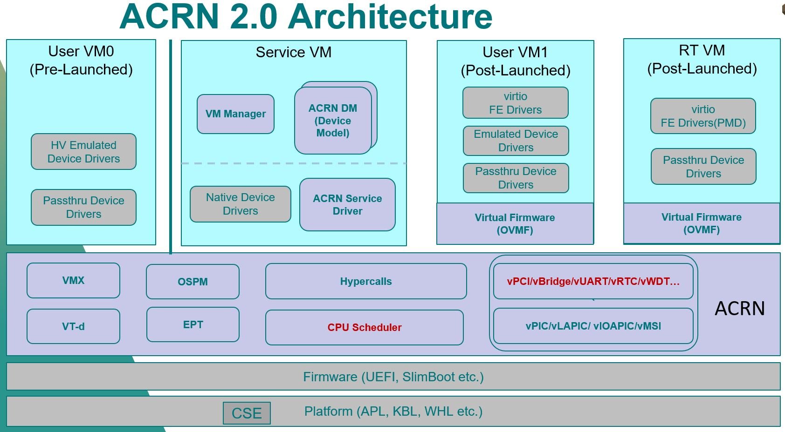

Resume
=====
## Personal Information
* Name:`Jason`
* Gender: `Male`
* Mobile: `15618652257`
* Email: `weitway@hotmail.com`
* Location: `Shanghai`
* Google doc(public): [Jason's doc](https://drive.google.com/drive/folders/0B-2c-6VcDCsHfmY4UzBISkt4SVFNWWhzbExGdU5ETG9Pcy1HLVA2SWw2eUwzU1BzR3NaM3M)
* This Resume: [resume](https://github.com/weitway/resume/blob/master/resume.md)

>*Tech Driving, Tech Living, Tech Thinking, Tech Talking*

## Summary
- Solid experience and profound understanding on virtualization/hypervisor framework.
- 10+ years solid experience on Linux Kernel/Driver development.
- Solid knowledge on x86 architecture & its HW virtualization technology.
- Profound understanding on SOC related eco-system, including both SW stack & Hardware platform.
- Proficient in C/assembly/shell, Linux system level programming.
- Strong capability of debugging, troubleshooting and problem resolving on both software and platform related issues.
- Experience of project management & people management.
- Good sense of quality control; be familiar with bug-tracking process and tools, GIT, clear case etc.

## Education
* #### 2001/09-2004/04
 >Shanghai Jiaotong university

 >Major in Electronic Engineering

 >Master

* #### 1997/09-2001/07
 >Tongji University

 >Major in Electronic Information Engineering

 >Bachelor

## Working Experience
* #### Period: 2017/6 – present
>#### Company:  `Intel IAGS`

>#### Title:  `Software engineering architect`

* ACRN Hypervisor [Link](https://projectacrn.org/) (*2017/6 - present*)

>Description: `An open source lightweight IoT Hypervisor`

>Key Words: `Virtualization, virtual machine, VMX, EPT, IOMMU, Interrupt Controller, PCI, pass-thru, Device Model, virtio, graphics, secure boot, function safety`

>Role: `Key contributor from the beginning. Arch design and leading the development`

* #### Period: 2012/3 – 2017/6
>#### Company:  `Intel MCG & PEG`

* #### Period: 2016/6 – 2017/6
>#### Title:  `Software engineering architect`

* Container security related project based on KVM/Qemu (*2016/10 - present*)

>Description: `Memory isolation based on Intel VT-x EPT technology and type II hypervisor KVM/Qemu`

>Key Words: `Virtualization, Security, KVM/Qemu, EPT, Multi-root_hpa, VMCALL, VMFUNC, Data-exchange, MMU`

>Role: `Arch design and leading the development`

* Container security related POC based on Hypersim (*2016/6 - 2016/10*)

>Description: `Memory isolation POC based on Intel VT-x EPT technology and type I hypervisor hypersim`

>Key Words: `Virtualization, Security, Hypersim, EPT, Multi-View, VMCALL, VMFUNC, Data-exchange, MMU`

>Role: `Arch design and leading the development`

* #### Period: 2014/7 – 2016/6
>#### Title:  `Software engineering manager`

*  LPSS Software CoE team manager

>Key Words: `LPSS, COE, android, windows, transition`

>Role: `leading the engineering activities on the software design, software development, software validation, and software release with good quality and high robustness`

* #### Period: 2012/3 – 2014/7
>#### Title:  `Senior Software engineer`

*  IO & Sensor Andorid RD team tech leader

>Key Words: `android, IO(I2C/SPI/UART/GPIO/PMIC/Touch/PCIE/IPC etc), Sensor(Gyro/Compass/Accelerometer/Proximity/Barometer/Ambient Light etc)`

>Role: `Features development, integration and bug fixing, project leader for CTP/LEX/CHT/BXT`

* #### Period: 2006/4 – 2012/3
>#### Company:  `Freescale`

>#### Title:  `Staff Software engineer`

*  i.MX series IPU(Image Process Unit)/Display/MMS owner

>Key Words: `Linux, android, IPU, pre/post processing, framebuffer, v4l2 capture/output, display(tve/vga/hdmi/lvds), MMS, Gstreamer`

>Role: `Features development, integration and bug fixing, project leader for i.MX37`

* #### Period: 2005/3 – 2006/4
>#### Company:  `USI Shanghai RD`

>#### Title:  `Senior Software engineer`

*  Digital home product developer

>Key Words: `Linux, VOIP, Digital Media Server, xscale, PowerPC`

>Role: `Porting BSP, establish basic system and maintenance, bug fixing`

* #### Period: 2004/4 – 2005/3
>#### Company:  `Shanghai Hualong RD Center`

>#### Title:  `Software engineer`

*  Embeded Linux PDA developer

>Key Words: `Linux, uclinux, PDA, s3c2410/44b0`

>Role: `Porting BSP, establish basic system and maintenance, bug fixing`

## Innovation & Bonus
* patent: Flexible sensor module for IOT sensing applications
* patent: A method and apparatus to mitigate the interference of split lock
* 2016 EIG Shanghai DRA
* 2018 & 2020 IAGS SSE DRA

## Hobby
* Badminton
* Swimming
* Travel/hiking
* Photograph

